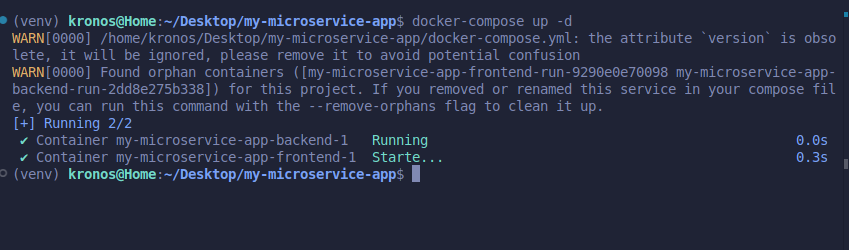

# frontend

## Project setup
```
npm install
```

### Compiles and hot-reloads for development
```
npm run serve
```

### Compiles and minifies for production
```
npm run build
```

### Lints and fixes files
```
npm run lint
```

### Customize configuration
See [Configuration Reference](https://cli.vuejs.org/config/).

## Manual CI/CD Workflow

1. **Build Docker images**
   ```
   docker-compose build
   ```

2. **Run tests**
   ```
   docker-compose run backend python -m unittest
   docker-compose run frontend npm run test
   ```


3. **Deploy (start services)**
   ```
   docker-compose up -d
   ```

4. **Update after code changes**
   ```
   docker-compose build
   docker-compose up -d
   ```

5. **Teardown**
   ```
   docker-compose down
   ```

